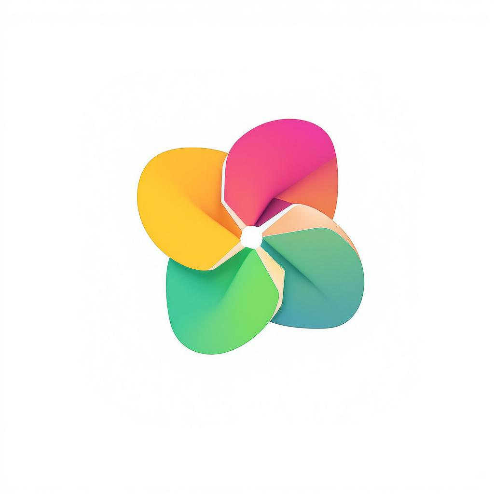

<div align="center">
  

# Pixora

### Your Photos, Your Privacy

_The smart alternative to Google Photos that respects your privacy_

[](https://github.com/yourusername/pixora/releases)
[](https://www.virustotal.com/gui/file/57ca67e266442320232ce7be03919319e8acbf2024fcb6f594baf7b98dcbeae3)
[]()
[]()

[Download](#-download) • [Features](#-features) • [Privacy](#-privacy--security) • [Roadmap](#-future-updates)

</div>

---

## 🎯 Why Pixora?

Your photos are your memories. Tl Googluldn't be used to train AI, show you ads, or build a profile about you. **Pixora** is a privacy-first photo management app that gives you complete control over your photos.

### The Problem with Other Apps

- 📊 **Google Photos**: Scans your photos for AI training, shows ads, tracks your behavior
- 💰 **iCloud**: Expensive storage, locked into Apple ecosystem
- 🔒 **Other Apps**: Hidden costs, privacy concerns, data mining

### The Pixora Solution

- ✅ **100% Privacy Focused** - Your photos stay on your device by default
- ✅ **No AI Training** - We never use your photos to train machine learning models
- ✅ **No Tracking** - Zero analytics, no surveillance, no data collection
- ✅ **No Ads** - Completely ad-free experience
- ✅ **Free Forever** - No hidden costs, no premium tiers
- ✅ **Optional Cloud Backup** - You choose if and when to backup

---

## ✨ Features

### 📸 Photo Management

- **Beautiful Gallery** - View all your photos in a stunning, organized grid
- **Smart Organization** - Create albums, mark favorites, organize by date
- **Quick Search** - Find photos instantly by name or date
- **Trash & Recovery** - Deleted by mistake? Recover within 30 days
- **Photo Editing** - Basic editing tools (crop, rotate, adjust)

### ☁️ Cloud Backup (Optional)

- **Auto-Backup** - Automatically backup new photos in the background
- **WiFi-Only Mode** - Save mobile data by backing up only on WiFi
- **Selective Backup** - Choose which photos to backup
- **Background Sync** - Backup continues even when app is closed
- **Fast Sync** - Efficient syncing with smart deduplication

### 🔐 Privacy & Security

- **Local-First Storage** - Photos stored on your device by default
- **End-to-End Encryption** - All cloud data encrypted (see [How Encryption Works](#-how-encryption-works))
- **Biometric Lock** - Secure app with fingerprint or face unlock
- **No Tracking** - Zero analytics or surveillance technology
- **Secure Authentication** - OAuth 2.0 with Google (optional)

### ⚡ Performance

- **Lightning Fast** - Optimized for smooth scrolling and instant loading
- **Memory Efficient** - Smart caching and memory management
- **Battery Friendly** - Background tasks optimized for battery life
- **Offline First** - Works perfectly without internet connection
- **Dark Mode** - Easy on the eyes with beautiful dark theme

### 🎨 User Experience

- **Intuitive Interface** - Clean, modern design
- **Smooth Animations** - Polished transitions and effects
- **Responsive** - Works great on all screen sizes
- **Accessibility** - Designed for everyone

---

## 📥 Download

### Official Releases

<div align="center">

| Platform       | Status         | Download                                                                                                                                      |
| -------------- | -------------- | --------------------------------------------------------------------------------------------------------------------------------------------- |
| 🤖 **Android** | Comming soon   | [Google Play](https://play.google.com/store) • [APKPure](https://apkpure.com) • [Direct APK](https://github.com/yourusername/pixora/releases) |
| 🍎 **iOS**     | 🔜 Coming Soon | App Store (In Development)                                                                                                                    |

</div>

### System Requirements

- **Android**: 5.0 (Lollipop) or higher
- **Storage**: 100 MB for app + space for photos
- **RAM**: 2 GB minimum (4 GB recommended)
- **Permissions**: Photos, Camera (optional), Internet (for backup)

### Installation

#### From Google Play (Recommended)

Comming Soon

#### From APK (Direct Download)

1. Download APK from [Releases](https://github.com/yourusername/pixora/releases)
2. Enable "Install from unknown sources" in Settings
3. Open APK file and install
4. **Security**: All APKs are scanned by [VirusTotal](https://www.virustotal.com/gui/file/57ca67e266442320232ce7be03919319e8acbf2024fcb6f594baf7b98dcbeae3) (0/64 detections)

---

## 🔒 Privacy & Security

### Our Privacy Promise

1. **Your Data is Yours**

   - Photos stored locally on your device
   - Cloud backup is completely optional
   - You can delete everything anytime

2. **No Surveillance**

   - We don't scan your photos
   - We don't track your behavior
   - We don't sell your data
   - We don't show you ads

3. **Transparent**
   - Clear privacy policy
   - No hidden data collection
   - You control what's shared

### 🔐 How Encryption Works

Pixora uses industry-standard encryption to protect your data:

#### Local Storage

- **Device Encryption**: Photos stored using Android's built-in encryption
- **Secure Storage**: Sensitive data (tokens, passwords) stored in Android Keystore
- **Biometric Protection**: Optional fingerprint/face unlock for app access

#### Cloud Backup (When Enabled)

```
Your Device                    Our Servers
    │                              │
    ├─ Photo.jpg                   │
    │                              │
    ├─ Encrypt with AES-256        │
    │  (Your unique key)           │
    │                              │
    ├─ Encrypted Data ────────────>│
    │                              │
    │                         Store encrypted
    │                         (We can't read it)
    │                              │
    ├─ Download ◄──────────────────┤
    │                              │
    ├─ Decrypt with your key       │
    │                              │
    └─ Photo.jpg                   │
```

**Key Points:**

- **AES-256 Encryption**: Military-grade encryption standard
- **Unique Keys**: Each user has unique encryption keys
- **Zero-Knowledge**: We can't access your photos even if we wanted to
- **Secure Transit**: HTTPS/TLS for all data transmission
- **No Backdoors**: No way for anyone (including us) to bypass encryption

#### Authentication Security

- **OAuth 2.0**: Industry-standard authentication
- **JWT Tokens**: Secure, short-lived access tokens
- **No Password Storage**: We never store your password
- **Secure Sessions**: Encrypted session management

---

## 🚀 Future Updates

### Version 1.1 (Coming Soon)

- [ ] **Photo Sharing** - Share photos securely with friends
- [ ] **Collaborative Albums** - Create shared albums
- [ ] **Advanced Editing** - More editing tools and filters
- [ ] **Video Support** - Backup and manage videos
- [ ] **Face Recognition** (Local) - Organize by people (on-device only)

### Version 1.2 (Planned)

- [ ] **iOS App** - iPhone and iPad support
- [ ] **Desktop Apps** - Windows, macOS, Linux
- [ ] **Photo Stories** - Create beautiful photo stories
- [ ] **Advanced Search** - Search by location, objects, colors
- [ ] **Duplicate Detection** - Find and remove duplicate photos

### Version 2.0 (Future)

- [ ] **End-to-End Encrypted Sharing** - Share photos with zero-knowledge encryption
- [ ] **Family Vault** - Secure shared storage for families
- [ ] **Photo Printing** - Order prints directly from app
- [ ] **Smart Backup** - AI-powered backup optimization (on-device)
- [ ] **Multi-Device Sync** - Sync across all your devices

### Long-Term Vision

- **Open Source** - Make core components open source
- **Self-Hosting** - Host your own Pixora server
- **Federation** - Connect with other privacy-focused services
- **Blockchain Storage** - Decentralized storage options

---

## 🎯 Use Cases

### For Individuals

- 📱 **Personal Photo Library** - Organize all your memories
- 🔒 **Private Photos** - Keep sensitive photos secure
- 💾 **Backup Solution** - Reliable backup without privacy concerns
- 🎨 **Photo Editing** - Quick edits without leaving the app

### For Families

- 👨‍👩‍👧‍👦 **Family Photos** - Share memories safely
- 🎂 **Event Albums** - Organize birthdays, holidays, trips
- 👶 **Baby Photos** - Track your child's growth privately
- 🏠 **Home Organization** - Document your home and belongings

### For Professionals

- 📸 **Photography Backup** - Backup work photos securely
- 🎨 **Portfolio Management** - Organize your portfolio
- 📊 **Project Documentation** - Document projects visually
- 🔐 **Client Privacy** - Keep client photos confidential

---

## 🌟 What Makes Pixora Different?

### vs. Google Photos

| Feature         | Pixora                | Google Photos              |
| --------------- | --------------------- | -------------------------- |
| **Privacy**     | ✅ No tracking        | ❌ Tracks everything       |
| **AI Training** | ✅ Never              | ❌ Uses your photos        |
| **Ads**         | ✅ None               | ❌ Yes                     |
| **Cost**        | ✅ Free forever       | ⚠️ Limited free, then paid |
| **Offline**     | ✅ Full functionality | ⚠️ Limited                 |
| **Encryption**  | ✅ End-to-end         | ⚠️ Server-side only        |
| **Open Source** | 🔜 Planned            | ❌ Closed                  |

### vs. iCloud Photos

| Feature         | Pixora                  | iCloud Photos        |
| --------------- | ----------------------- | -------------------- |
| **Platform**    | ✅ Android (iOS coming) | ❌ Apple only        |
| **Cost**        | ✅ Free                 | ❌ $0.99-$9.99/month |
| **Privacy**     | ✅ Privacy-first        | ⚠️ Apple has access  |
| **Flexibility** | ✅ Optional cloud       | ❌ Cloud required    |
| **Encryption**  | ✅ End-to-end           | ⚠️ Not end-to-end    |

---

## 💡 Philosophy

### Our Beliefs

1. **Privacy is a Right** - Not a luxury or premium feature
2. **You Own Your Data** - Your photos belong to you, not us
3. **Transparency Matters** - No hidden agendas or dark patterns
4. **Free Doesn't Mean Product** - You're not the product, ads are not the answer
5. **Quality Over Quantity** - Better to do few things well than many things poorly

### Our Commitments

- ✅ **Never sell your data** - Not now, not ever
- ✅ **Never train AI on your photos** - Your memories are not training data
- ✅ **Never show ads** - Clean, distraction-free experience
- ✅ **Always be transparent** - Clear about what we do and don't do
- ✅ **Always respect privacy** - Privacy by design, not afterthought

---

## 📊 Technical Highlights

### Architecture

- **Local-First Design** - Works offline, syncs when online
- **Background Processing** - Smart background tasks for backup
- **Efficient Storage** - Optimized database and caching
- **Modern Stack** - Built with latest technologies

### Security

- **AES-256 Encryption** - Military-grade encryption
- **Secure Keystore** - Hardware-backed key storage
- **OAuth 2.0** - Industry-standard authentication
- **HTTPS/TLS** - Encrypted data transmission
- **Regular Security Audits** - Continuous security improvements

### Performance

- **Fast Loading** - Optimized image loading and caching
- **Smooth Scrolling** - 60 FPS scrolling with thousands of photos
- **Memory Efficient** - Smart memory management
- **Battery Optimized** - Minimal battery drain

---

## 🤝 Support

### Get Help

- 📧 **Email**: pixoraapp@proton.me
- 🌐 **Website**: [pixoracloud.qzz.io](https://pixoracloud.qzz.io)
- 📱 **In-App Support** - Help section in app settings

### Report Issues

Found a bug? Have a suggestion?

- Open an issue on GitHub (for technical users)
- Email us at pixoraapp@proton.me
- Use in-app feedback form

### FAQ

**Q: Is Pixora really free?**
A: Yes! Completely free with no hidden costs, premium tiers, or in-app purchases.

**Q: How do you make money?**
A: Currently, Pixora is a passion project. In the future, we may offer optional paid cloud storage for users who want more than the free tier.

**Q: Can I use Pixora offline?**
A: Absolutely! Pixora works perfectly offline. All your photos are stored locally.

**Q: How is this different from Google Photos?**
A: We don't scan your photos for AI training, show you ads, or track your behavior. Your photos stay private.

**Q: Is my data secure?**
A: Yes! We use end-to-end encryption for cloud backups, secure storage on your device, and never access your photos without permission.

**Q: Can I migrate from Google Photos?**
A: Yes! Simply download your photos from Google Photos and they'll automatically appear in Pixora.

---

## 📜 License

**Private Repository** - All rights reserved.

This software is proprietary and confidential. Unauthorized copying, distribution, or use is strictly prohibited.

---

## 🙏 Acknowledgments

Built with ❤️ for privacy-conscious users who deserve better.

Special thanks to:

- Everyone who values privacy
- Users who trust us with their memories
- The open-source community for inspiration

---

## 📱 Screenshots

<div align="center">
  
  
  
  
</div>

---

<div align="center">

### Ready to Take Control of Your Photos?

[](https://github.com/yourusername/pixora/releases)

**Your Photos. Your Privacy. Your Choice.**

---

Made with ❤️ for Privacy • © 2024 Pixora • [Privacy Policy](https://pixoracloud.qzz.io/privacy.html) • [Terms](https://pixoracloud.qzz.io/terms.html)

</div>
